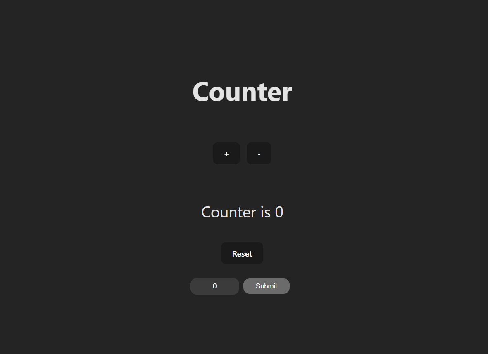

# 🧮 Counter App (TypeScript + Redux)

This is a simple counter application built using **React**, **Redux**, and **TypeScript**. It demonstrates basic usage of Redux for state management in a TypeScript environment.

[Counter App](https://stunning-medovik-b87f17.netlify.app/)

---

## 📦 Tech Stack

- **React**
- **Redux Toolkit** (`@reduxjs/toolkit`)
- **React-Redux**
- **TypeScript**
- **Vite** 

---

